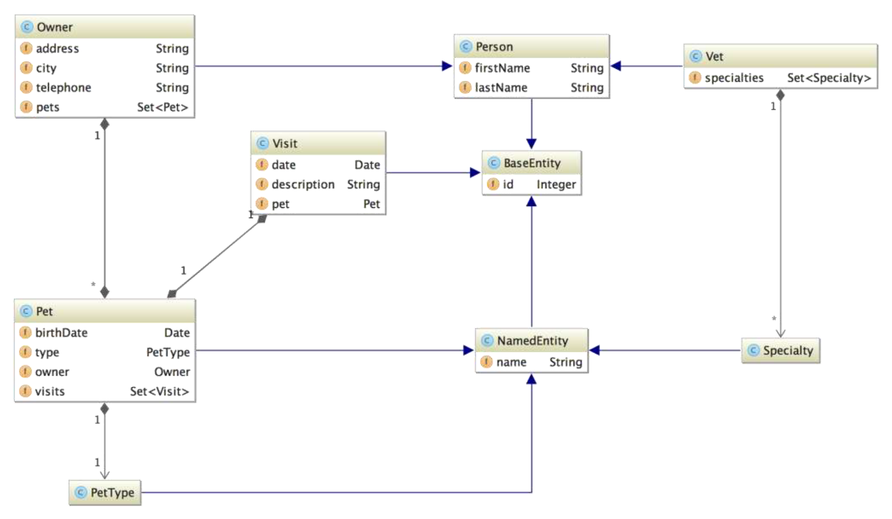
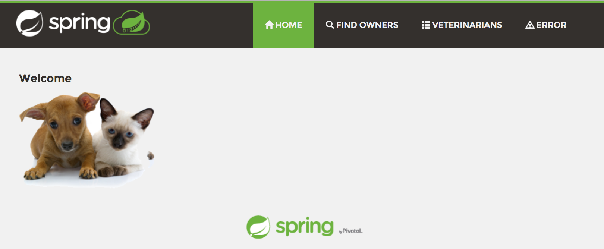
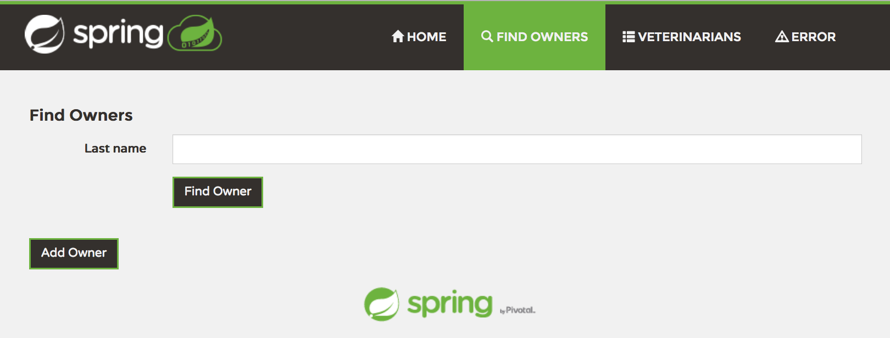
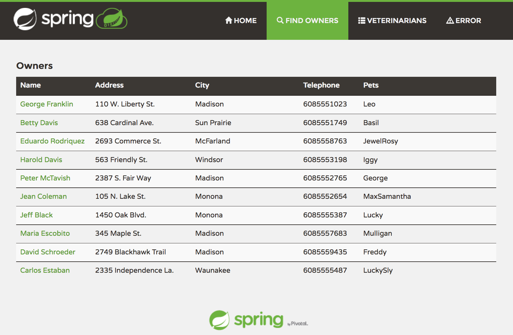
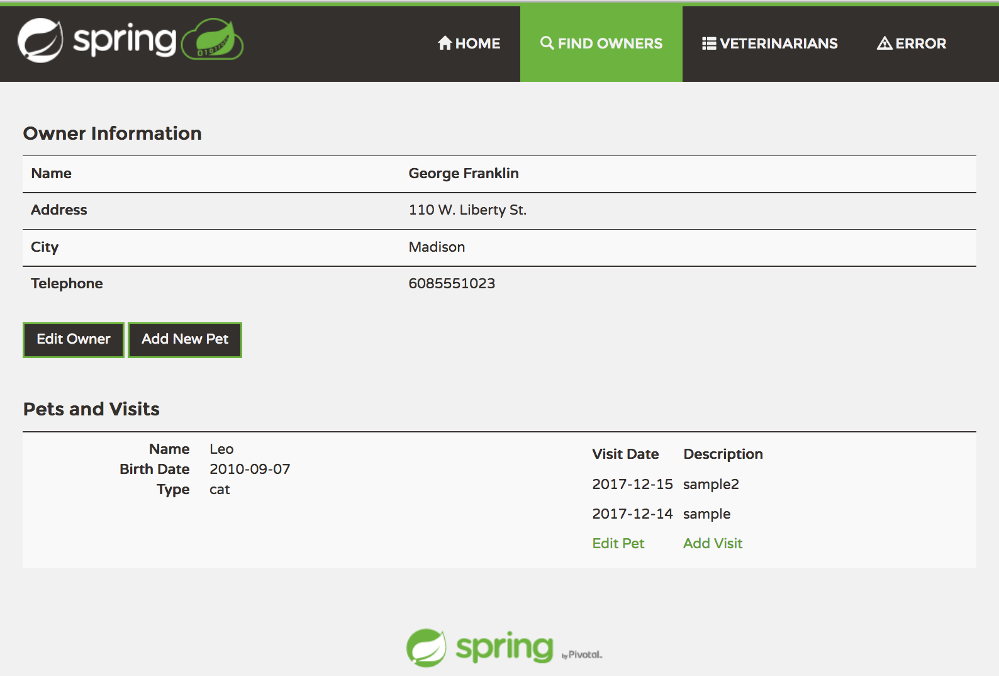
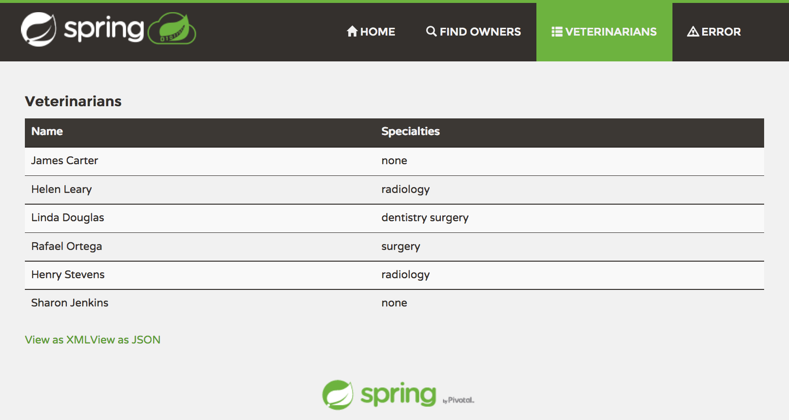

# 스프링 애플리케이션을 IBM Cloud Private (Kubernetes)로 마이그레이션 하기
  
* 스프링 샘플 애플리케이션 **PetClinic**을 도커 이미지로 만들어 ICP의 Private Docker Registry에 등록하고, 애플리케이션 구성을 기술하는 Deployment 객체를 YAML 포맷으로 작성해서 쿠버네티스 클러스터에 배포하는 과정을 설명합니다.

* 마이그레이션 실습 대상은 3가지 입니다.
	1. Spring Canonical : [Spring Boot](https://github.com/kmsandbox/petclinic-on-kubernetes/tree/master/spring-boot)

	2. Spring Framework : [Spring Framework](https://github.com/kmsandbox/petclinic-on-kubernetes/tree/master/spring-framework)

	3. Microservices : [Spring Cloud](https://github.com/kmsandbox/petclinic-on-kubernetes/tree/master/spring-microservices)

&nbsp;
### 목차

1. 전제조건
2. 테스트 및 배포 환경 
3. Spring PetClinc 샘플 애플리케이션 소개

&nbsp;
## 1. 전제조건

실습을 위해서는 Docker와 Kubernetes 등의 실행환경과 각종 관리도구가 필요합니다. 실습 시작 전에 아래 도구들을 테스트/운영 환경에 설치해주세요.

* 애플리케이션 실행환경
	1. Docker Toolbox [Install](https://docs.docker.com/toolbox/overview/)
	2. Kubernetes : 실습에서는 ICP CE를 사용합니다.
		- IBM Cloud Private Community Edition [Install](https://github.com/IBM/deploy-ibm-cloud-private/blob/master/docs/deploy-vagrant.md)
		- Minikube [Install](https://github.com/kubernetes/minikube)

* 빌드 및 관리 도구
	1. Git - [Install]()
	2. Maven - [Install](https://maven.apache.org/install.html)
	3. Kubectl [Install](https://kubernetes.io/docs/tasks/tools/install-kubectl/)
	4. Kompose [Install](https://github.com/kubernetes/kompose)
	5. IBM Cloud CLI  [Install](https://console.bluemix.net/docs/cli/reference/bluemix_cli/get_started.html#getting-started)
	6. IBM Cloud Private CLI - bx pr [Install](https://www.ibm.com/support/knowledgecenter/en/SSBS6K_2.1.0/manage_cluster/install_cli.html)

&nbsp;
## 2. 테스트 환경

1. 로컬 : MacOS, or Windows with Docker Toolbox

## 배포/운영 환경

1. MiniKube or ICP @ Local
	- MiniKube
	- ICP 서버 : Master, Proxy, Worker 1/2 [스펙]

&nbsp;
## 3. 스프링 PetClinic 샘플 애플리케이션

Spring PetClinic은 소유자와 애완동물, 수의사, 진료예약 등을 등록, 관리하는 간단한 샘플 애플리케이션입니다. 다양한 스프링 프레임워크 기술 스택을 활용해 간단하지만 강력한 DB 연동 애플리케이션을 구현하는 방법을 시연하는 목적을 가지고 있습니다.  

### Spring PetClinic의 다양한 버전

* [Spring Petclinic 마스터 브랜치](https://github.com/spring-projects/spring-petclinic)는 GitHub spring-projects 조직에서 관리되며, 현재 Spring Boot와 Thymeleaf로 구현되어 있습니다. 그 외에도 Spring Framework, AngularJS, Spring Cloud 등 다른 기술스택으로 구현된 버전이 있습니다.

Link	| Main technologies
-------|-----
[spring-petclinic](https://github.com/spring-projects/spring-petclinic)	| Spring Boot
[spring-framework-petclinic](https://github.com/spring-petclinic/spring-framework-petclinic)	| Spring Framework XML configuration, JSP pages, 3 persistence layers: JDBC, JPA and Spring Data JPA
[spring-petclinic-microservices](https://github.com/spring-petclinic/spring-petclinic-microservices)	| Distributed version of Spring Petclinic built with Spring Cloud
[spring-petclinic-angularjs](https://github.com/spring-petclinic/spring-petclinic-angularjs)	| AngularJS 1.x, Spring Boot and Spring Data JPA
[spring-petclinic-angular](https://github.com/spring-petclinic/spring-petclinic-angular)	| Angular 4 front-end of the Petclinic REST API [spring-petclinic-rest](https://github.com/spring-petclinic/spring-petclinic-rest)
[spring-petclinic-rest](https://github.com/spring-petclinic/spring-petclinic-rest)	|	Backend REST API
[spring-petclinic-reactjs](https://github.com/spring-petclinic/spring-petclinic-reactjs)	| ReactJS (with TypeScript) and Spring Boot
[spring-petclinic-graphql](https://github.com/spring-petclinic/spring-petclinic-graphql)	| GraphQL version based on React Appolo, TypeScript and GraphQL Spring boot starter
[spring-petclinic-kotlin](https://github.com/spring-petclinic/spring-petclinic-kotlin)		| Kotlin version of spring-petclinic

&nbsp;
#### Spring PetClinic: Domain Model

&nbsp;
#### Spring PetClinic: Screenshots

메인 페이지

&nbsp;
소유자 찾기

&nbsp;
소유자 목록

&nbsp;
소유자 상세정보 

&nbsp;
수의사 목록
 

&nbsp;

  

