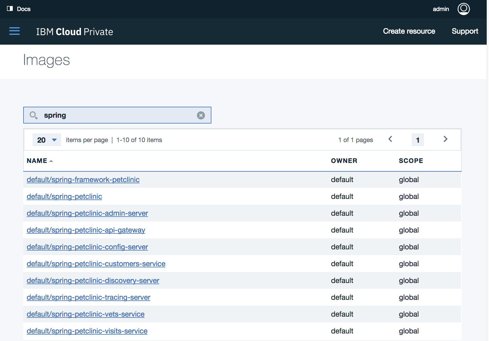

# Spring Cloud - PetClinic Application 


## 기술 구성

Category | Spring Cloud Petclinic
---------|---------
Spring stack	|	Spring Cloud
Architecture	|	Microservices
Persistence	|	Spring Data JPA
View	|	AngularJS
Databases support	|	HSQLDB, MySQL


&nbsp;
## 목차

* Step 1: 실습용 쉘 스크립트 다운로드
* Step 2: 마이그레이션 대상 애플리케이션의 도커 이미지 빌드
* Step 3: 도커 컨테이너 실행 및 애플리케이션 서비스 동작 확인
* Step 4: IBM Cloud Private - Private Docker Registry에 이미지 등록하기
* Step 5: IBM Cloud Private에 샘플 애플리케이션 배포하기  

&nbsp;
## 구성요소

Spring Cloud components|URL & Port|Desc.
-----|------|------
Config Server | http://localhost:8888 | 컨피그 관리
Discovery Server | http://localhost:8761 | 서비스 디스커버리
AngularJS frontend (API Gateway) | http://localhost:8080 | 프론트엔드 페이지 
Customers, Vets and Visits Services | random port, check Eureka Dashboard | 
Tracing Server (Zipkin) | http://localhost:9411 | 마이크로서비스 트레이싱
Admin Server (Spring Boot Admin) | http://localhost:9090 | 관리 서버


&nbsp;
### Step 1: 실습용 쉘 스크립트 다운로드

	# git clone https://github.com/kmsandbox/petclinic-on-kubernetes.git
	# cd spring-cloud


&nbsp;
### Step 2: 마이그레이션 대상 애플리케이션의 도커 이미지 빌드


#### A. 샘플 애플리케이션 소스 다운로드 (spring-cloud/clone-petclinic-microservices.sh)

	# git clone https://github.com/spring-petclinic/spring-petclinic-microservices.git


#### B. 픽스 적용 : 의존성 정보 추가 (spring-cloud/apply-fixes.sh)

일부 서비스들의 pom.xml에서 codehaus stax2-api에 대한 의존성 정보가 빠져있습니다.

	<dependency>
	   <groupId>org.codehaus.woodstox</groupId>
	   <artifactId>stax2-api</artifactId>
	   <version>3.1.1</version>
	</dependency>

아래 명령어를 실행해 의존성 정보를 추가합니다.

	# cp fixes/customers-pom.xml spring-petclinic-microservices/spring-petclinic-customers-service/pom.xml
	# cp fixes/visits-pom.xml spring-petclinic-microservices/spring-petclinic-visits-service/pom.xml
	# cp fixes/vets-pom.xml spring-petclinic-microservices/spring-petclinic-vets-service/pom.xml


#### C. 도커 이미지 빌드 (spring-cloud/build-docker-images.sh)

	# cd spring-petclinic-microservices
	# mvn clean install -PbuildDocker

* 각 서비스 폴더의 ./src/main/docker/에 Dockerfile가 미리 작성되어 있습니다.

```
FROM java:8
VOLUME /tmp
ADD https://raw.githubusercontent.com/vishnubob/wait-for-it/master/wait-for-it.sh wait-for-it.sh
RUN bash -c 'chmod +x wait-for-it.sh'
ARG ARTIFACT_NAME
ADD ${ARTIFACT_NAME}.jar /app.jar
ENV SPRING_PROFILES_ACTIVE docker
RUN bash -c 'touch /app.jar'
EXPOSE <PORT_NUM>
ENTRYPOINT ["java","-Djava.security.egd=file:/dev/./urandom","-jar","/app.jar"]
```

#### D. 도커 이미지 확인 

	# docker images
	
	REPOSITORY                                       TAG                 IMAGE ID            CREATED             SIZE
	mszarlinski/spring-petclinic-tracing-server      latest              bb8098454217        13 minutes ago      720MB
	mszarlinski/spring-petclinic-api-gateway         latest              a962c2f00daf        13 minutes ago      738MB
	mszarlinski/spring-petclinic-discovery-server    latest              ae078e75062a        15 minutes ago      723MB
	mszarlinski/spring-petclinic-config-server       latest              03be666972d3        16 minutes ago      691MB
	mszarlinski/spring-petclinic-visits-service      latest              f3e239937900        16 minutes ago      750MB
	mszarlinski/spring-petclinic-vets-service        latest              affd2d4535a3        17 minutes ago      754MB
	mszarlinski/spring-petclinic-customers-service   latest              7379b79a3631        17 minutes ago      750MB
	mszarlinski/spring-petclinic-admin-server        latest              968f24280672        18 minutes ago      719MB


&nbsp;
### Step 3: 도커 컨테이너 실행 및 애플리케이션 서비스 동작 확인


#### A. 컨테이너 실행 (spring-cloud/test-local-docker-1.sh)

	# cd spring-petclinic-microservices
	# docker-compose up 
	
docker-compose up으로 서비스가 잘 시작되지 않는다면 아래 명령어를 순차적으로 실행시켜 다시 시도합니다. (spring-cloud/test-local-docker-2.sh)
	
	# docker-compose up config-server &
	# sleep 60s
	# docker-compose up discovery-server &
	# sleep 60s
	# docker-compose up customers-service &
	# sleep 10s
	# docker-compose up vets-service &
	# sleep 10s
	# docker-compose up visits-service &
	# sleep 10s
	# docker-compose up api-gateway &
	# sleep 10s
	# docker-compose up admin-server &
	# sleep 10s
	# docker-compose up tracing-server &


#### B. 컨테이너 목록 확인

	# docker ps | grep spring-petclinic
	

#### C. 접속 확인

	# curl http://localhost:8761
	# curl http://localhost:8888
	# curl http://localhost:8080
	# curl http://localhost:9411
	# curl http://localhost:9090
	

#### D. 컨테이너 제거

	# cd spring-petclinic-microservices
	# docker-compose down
	

&nbsp;
### Step 4: IBM Cloud Private - Private Docker Registry에 이미지 등록하기

* ICP의 Private Docker Registry에 등록되는 이미지는 Kubernetes Cluster와 Namespace 별로 구분됩니다. 여기에서는 Cluster와 Namespace를 각각 아래와 같이 기입해 사용합니다.
	* Cluster Name : mycluster.icp  [ICP CE 설치시 디폴트 클러스터]
	* Namespace Name : default  [ICP CE 설치시 디폴트 네임스페이스]  
	

#### A. 이미지 이름 변경 (spring-cloud/retag-image.sh)

	# docker tag mszarlinski/spring-petclinic-tracing-server:latest mycluster.icp:8500/default/spring-petclinic-tracing-server:latest
	# docker tag mszarlinski/spring-petclinic-api-gateway:latest mycluster.icp:8500/default/spring-petclinic-api-gateway:latest
	# docker tag mszarlinski/spring-petclinic-discovery-server:latest mycluster.icp:8500/default/spring-petclinic-discovery-server:latest
	# docker tag mszarlinski/spring-petclinic-config-server:latest mycluster.icp:8500/default/spring-petclinic-config-server:latest
	# docker tag mszarlinski/spring-petclinic-visits-service:latest mycluster.icp:8500/default/spring-petclinic-visits-service:latest
	# docker tag mszarlinski/spring-petclinic-vets-service:latest mycluster.icp:8500/default/spring-petclinic-vets-service:latest
	# docker tag mszarlinski/spring-petclinic-customers-service:latest mycluster.icp:8500/default/spring-petclinic-customers-service:latest
	# docker tag mszarlinski/spring-petclinic-admin-server:latest mycluster.icp:8500/default/spring-petclinic-admin-server:latest


#### B. 이미지 이름 확인 
	
	# docker images | grep spring-petclinic
	
	mszarlinski/spring-petclinic-tracing-server                      latest              bb8098454217        3 hours ago         720MB
	mycluster.icp:8500/default/spring-petclinic-tracing-server      latest              bb8098454217        3 hours ago         720MB
	mszarlinski/spring-petclinic-api-gateway                         latest              a962c2f00daf        3 hours ago         738MB
	mycluster.icp:8500/default/spring-petclinic-api-gateway         latest              a962c2f00daf        3 hours ago         738MB
	mszarlinski/spring-petclinic-discovery-server                    latest              ae078e75062a        3 hours ago         723MB
	mycluster.icp:8500/default/spring-petclinic-discovery-server    latest              ae078e75062a        3 hours ago         723MB
	mszarlinski/spring-petclinic-config-server                       latest              03be666972d3        3 hours ago         691MB
	mycluster.icp:8500/default/spring-petclinic-config-server       latest              03be666972d3        3 hours ago         691MB
	mszarlinski/spring-petclinic-visits-service                      latest              f3e239937900        3 hours ago         750MB
	mycluster.icp:8500/default/spring-petclinic-visits-service      latest              f3e239937900        3 hours ago         750MB
	mszarlinski/spring-petclinic-vets-service                        latest              affd2d4535a3        3 hours ago         754MB
	mycluster.icp:8500/default/spring-petclinic-vets-service        latest              affd2d4535a3        3 hours ago         754MB
	mszarlinski/spring-petclinic-customers-service                   latest              7379b79a3631        3 hours ago         750MB
	mycluster.icp:8500/default/spring-petclinic-customers-service   latest              7379b79a3631        3 hours ago         750MB
	mszarlinski/spring-petclinic-admin-server                        latest              968f24280672        3 hours ago         719MB
	mycluster.icp:8500/default/spring-petclinic-admin-server        latest              968f24280672        3 hours ago         719MB
	

#### C. ICP Private Docker Registry에 로그인

***확인 필요 : 로컬에서 ICP Private Docker Registry 에 연결하는 방법  ***

	# docker login mycluster.icp:8500


#### D. ICP Private Docker Registry에 이미지 등록 (spring-cloud/push-image.sh)

	# docker push mycluster.icp:8500/default/spring-petclinic-config-server:latest
	# docker push mycluster.icp:8500/default/spring-petclinic-discovery-server:latest
	# docker push mycluster.icp:8500/default/spring-petclinic-customers-service:latest
	# docker push mycluster.icp:8500/default/spring-petclinic-vets-service:latest
	# docker push mycluster.icp:8500/default/spring-petclinic-visits-service:latest
	# docker push mycluster.icp:8500/default/spring-petclinic-api-gateway:latest
	# docker push mycluster.icp:8500/default/spring-petclinic-admin-server:latest
	# docker push mycluster.icp:8500/default/spring-petclinic-tracing-server:latest
	

#### E. ICP UI에서 등록된 이미지 목록 확인




&nbsp;
### Step 5: IBM Cloud Private에 샘플 애플리케이션 배포하기


#### A. Kompose로 docker-compose.yml을 변환해 Kubernetes용 yaml 만들기 (spring-cloud/convert-docker-compose.sh)

Kompose는 Compose 포맷 YAML 파일을 Kubernetes 포맷으로 변경해주는 도구입니다. 아래 명령어를 실행하면 각 애플리케이션 서비스에 대해 Service와 Deployment 객체가 만들어 집니다.

	# cd yaml4kube
	# cp ../spring-petclinic-microservices/docker-compose.yml .
	# kompose convert -f docker-compose.yml

		WARN Unsupported depends_on key - ignoring        
		INFO Kubernetes file "admin-server-service.yaml" created 
		INFO Kubernetes file "api-gateway-service.yaml" created 
		INFO Kubernetes file "config-server-service.yaml" created 
		INFO Kubernetes file "customers-service-service.yaml" created 
		INFO Kubernetes file "discovery-server-service.yaml" created 
		INFO Kubernetes file "tracing-server-service.yaml" created 
		INFO Kubernetes file "vets-service-service.yaml" created 
		INFO Kubernetes file "visits-service-service.yaml" created 
		INFO Kubernetes file "admin-server-deployment.yaml" created 
		INFO Kubernetes file "api-gateway-deployment.yaml" created 
		INFO Kubernetes file "config-server-deployment.yaml" created 
		INFO Kubernetes file "customers-service-deployment.yaml" created 
		INFO Kubernetes file "discovery-server-deployment.yaml" created 
		INFO Kubernetes file "tracing-server-deployment.yaml" created 
		INFO Kubernetes file "vets-service-deployment.yaml" created 
		INFO Kubernetes file "visits-service-deployment.yaml" created 


#### B. 생성된 yaml에서 image와 command-arg 수정 (spring-cloud/replace-imagenames-in-yaml.sh)

	# cp -rf yaml4kube yaml4kube-replaced 
	# cd yaml4kube-replaced
	# mkdir replaced
	# sed 's=mszarlinski=mycluster.icp:8500/default=g' < config-server-deployment.yaml	> replaced/config-server-deployment.yaml	
	# sed 's=mszarlinski=mycluster.icp:8500/default=g' < discovery-server-deployment.yaml	> replaced/discovery-server-deployment.yaml	
	# sed 's=mszarlinski=mycluster.icp:8500/default=g' < customers-service-deployment.yaml	> replaced/customers-service-deployment.yaml	
	# sed 's=mszarlinski=mycluster.icp:8500/default=g' < vets-service-deployment.yaml > replaced/vets-service-deployment.yaml
	# sed 's=mszarlinski=mycluster.icp:8500/default=g' < visits-service-deployment.yaml > replaced/visits-service-deployment.yaml
	# sed 's=mszarlinski=mycluster.icp:8500/default=g' < api-gateway-deployment.yaml > replaced/api-gateway-deployment.yaml		
	# sed 's=mszarlinski=mycluster.icp:8500/default=g' < tracing-server-deployment.yaml > replaced/tracing-server-deployment.yaml
	# sed 's=mszarlinski=mycluster.icp:8500/default=g' < admin-server-deployment.yaml > replaced/admin-server-deployment.yaml
	# cp replaced/* .
	# rm -rf replaced

#### C. deployment.yaml 파일에서 containers의 command 파라미터를 수정    

	# cp -rf yaml4kube-replaced yaml4kube-ready
	# cd yaml4kube-ready

* 수정 대상
	* discovery-server-deployment.yaml

	* 수정 전
	      - command:
	        - ./wait-for-it.sh
	        - config-server:8888
	        - --timeout=60
	        - --
	        - java
	        - -Djava.security.egd=file:/dev/./urandom
	        - -jar
	        - /app.jar

	* 수정 후
	      - command: ["/bin/sh", "-c"]
	        args: ["java -Djava.security.egd=file:/dev/./urandom -jar /app.jar"]

* 수정 대상
	* customers-service-deployment.yaml
	* vets-service-deployment.yaml
	* visits-service-deployment.yaml
	* api-gateway-deployment.yaml 
	* tracing-server-deployment.yaml
	* admin-server-deployment.yaml

	* 수정 전
	      - command:
	        - ./wait-for-it.sh
	        - discovery-server:8761
	        - --timeout=60
	        - --
	        - java
	        - -Djava.security.egd=file:/dev/./urandom
	        - -jar
	        - /app.jar

	* 수정 후
	      - command: ["/bin/sh", "-c"]
	        args: ["java -Djava.security.egd=file:/dev/./urandom -jar /app.jar"]


#### D. 샘플 애플리케이션 객체 배포 (spring-cloud/kube-apply.sh)

	# kubectl apply -f yaml4kube-ready/config-server-service.yaml
	# kubectl apply -f yaml4kube-ready/config-server-deployment.yaml
	# sleep 10s
	# kubectl apply -f yaml4kube-ready/discovery-server-deployment.yaml
	# kubectl apply -f yaml4kube-ready/discovery-server-service.yaml
	# sleep 10s
	# kubectl apply -f yaml4kube-ready/customers-service-deployment.yaml
	# kubectl apply -f yaml4kube-ready/customers-service-service.yaml
	# sleep 3s
	# kubectl apply -f yaml4kube-ready/vets-service-deployment.yaml
	# kubectl apply -f yaml4kube-ready/vets-service-service.yaml
	# sleep 3s
	# kubectl apply -f yaml4kube-ready/visits-service-deployment.yaml
	# kubectl apply -f yaml4kube-ready/visits-service-service.yaml
	# sleep 3s
	# kubectl apply -f yaml4kube-ready/api-gateway-service.yaml
	# kubectl apply -f yaml4kube-ready/api-gateway-deployment.yaml
	# sleep 3s
	# kubectl apply -f yaml4kube-ready/tracing-server-service.yaml
	# kubectl apply -f yaml4kube-ready/tracing-server-deployment.yaml
	# sleep 3s
	# kubectl apply -f yaml4kube-ready/admin-server-deployment.yaml
	# kubectl apply -f yaml4kube-ready/admin-server-service.yaml		

	# kubectl get deployment,svc,pods,pvc	


#### E. 배포 결과 확인

서비스 목록을 확인해 각 샘플 애플리케이션 서비스의 NodePort를 확인하고, 서비스 동작 여부를 확인합니다.

	# kubectl get deploy,svc
	
	# curl http://<Proxy_IP>:<NodePort>


#### F. 샘플 애플리케이션 객체 제거  (spring-cloud/kube-delete.sh)

	# kubectl delete -f yaml4kube-ready/config-server-service.yaml	
	# kubectl delete -f yaml4kube-ready/config-server-deployment.yaml	
	# kubectl delete -f yaml4kube-ready/discovery-server-deployment.yaml	
	# kubectl delete -f yaml4kube-ready/discovery-server-service.yaml	
	# kubectl delete -f yaml4kube-ready/customers-service-deployment.yaml	
	# kubectl delete -f yaml4kube-ready/customers-service-service.yaml		
	# kubectl delete -f yaml4kube-ready/vets-service-deployment.yaml
	# kubectl delete -f yaml4kube-ready/vets-service-service.yaml		
	# kubectl delete -f yaml4kube-ready/visits-service-deployment.yaml
	# kubectl delete -f yaml4kube-ready/visits-service-service.yaml	
	# kubectl delete -f yaml4kube-ready/api-gateway-service.yaml	
	# kubectl delete -f yaml4kube-ready/api-gateway-deployment.yaml		
	# kubectl delete -f yaml4kube-ready/tracing-server-service.yaml
	# kubectl delete -f yaml4kube-ready/tracing-server-deployment.yaml
	# kubectl delete -f yaml4kube-ready/admin-server-deployment.yaml	
	# kubectl delete -f yaml4kube-ready/admin-server-service.yaml

	# kubectl get deployment,svc,pods,pvc


&nbsp;
### Spring Cloud PetClinic Application: Screenshots

